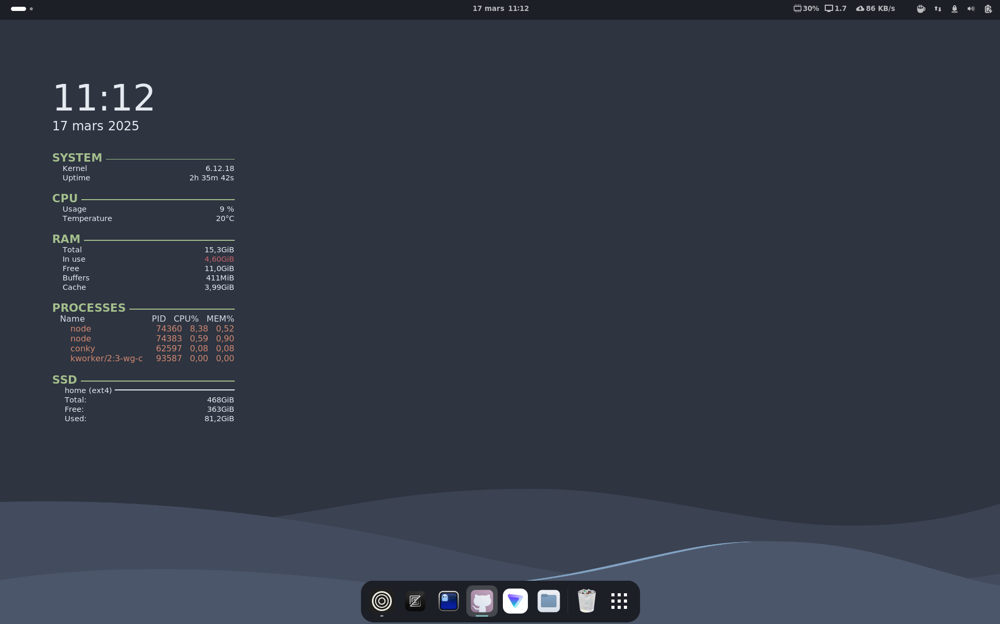

# ❄️ NixOS FAF DEV ❄️

<p align="center">
    <a href="https://nixos.org/">
        
    </a>
    <a href="https://nixos.wiki/wiki/Flakes">
        
    </a>
    <a href="https://nix-community.github.io/home-manager/">
        
    </a>
</p>

## ✨ Table des matières

- [💻 Introduction](#user-content-️-introduction)
- [⚙️ Configuration système](#user-content-️-configuration-systeme)
- [📦 Gestion des paquets](#user-content-️-gestion-des-paquets)
- [🛠️ Mises à jour](#user-content-️-mises-a-jour)
- [❄️ Environnements de développement](#user-content-️-environnements-de-developpement")
- [🧊 Gestion de services](#user-content-️-gestion-de-services)
- [🚧 Dépannage](#user-content-️-depannage)
- [📗 Ressources utiles](#user-content-️-ressources-utiles)
- [🔥 Notice d'installation de NixOS FAF DEV avec dotfiles](#user-content-️-notice-dinstallation-de-nixos-faf-dev-avec-dotfiles)
- [🪛 Mise à jour future](#user-content-️-mise-a-jour-future)
- [❗ Notes importantes](#user-content-️-notes-importantes)
- [🎛️ Packages Inclus](#user-content-️-packages-inclus)



## 💻 Introduction

NixOS est une distribution Linux basée sur le gestionnaire de paquets Nix, qui offre une approche déclarative de la configuration système, des déploiements reproductibles et la possibilité de revenir à des configurations antérieures.

## ⚙️ Configuration système

La configuration de NixOS est centralisée dans un fichier principal:

```bash
# Apres installation classic depuis une image
# Éditer la configuration principale et ajouter git aux pkgs
sudo nano /etc/nixos/configuration.nix

# Appliquer la configuration
sudo nixos-rebuild switch
```

## 📦 Gestion des paquets

### Commandes Nix de base

```bash
# Installer un paquet temporairement dans l'environnement utilisateur
nix-env -iA nixos.nom_du_paquet

# Désinstaller un paquet
nix-env -e nom_du_paquet

# Lister les paquets installés
nix-env -q

# Rechercher un paquet
nix search nom_du_paquet

# Mettre à jour les paquets installés avec nix-env
nix-env -u
```

### Méthode recommandée: via configuration.nix

```nix
# Dans configuration.nix
environment.systemPackages = with pkgs; [
  firefox
  git
  vim
];
```

## 🛠️ Mises à jour

```bash
# Mettre à jour les canaux Nix
sudo nix-channel --update

# Mettre à jour le système complet
sudo nixos-rebuild switch --upgrade

# Collecter les déchets (nettoyage)
sudo nix-collect-garbage -d
```

## ❄️ Environnements de développement

### Shells temporaires avec nix-shell

```bash
# Shell temporaire avec des paquets
nix-shell -p python3 python3Packages.numpy

# Créer un fichier shell.nix pour un projet
cat > shell.nix << EOF
{ pkgs ? import <nixpkgs> {} }:
pkgs.mkShell {
  buildInputs = with pkgs; [
    python3
    python3Packages.numpy
  ];
}
EOF

# Entrer dans l'environnement
nix-shell
```

### Utiliser direnv avec Nix

```bash
# Installation
nix-env -iA nixos.direnv

# Dans ~/.bashrc ou ~/.zshrc
eval "$(direnv hook bash)" # ou zsh

# Créer un .envrc
echo "use nix" > .envrc
direnv allow
```

## 🧊 Gestion de services

```bash
# Vérifier le statut d'un service
systemctl status service_name

# Démarrer/arrêter un service
sudo systemctl start/stop service_name

# Activer/désactiver au démarrage
sudo systemctl enable/disable service_name

# Voir les logs d'un service
journalctl -u service_name
```

## 🚧 Dépannage

```bash
# Revenir à une configuration précédente (après un boot)
sudo nixos-rebuild switch --rollback

# Voir les générations disponibles
sudo nix-env --list-generations --profile /nix/var/nix/profiles/system

# Démarrer en mode rescue
# Au menu GRUB, ajouter "systemd.unit=rescue.target" aux options de démarrage

# Vérifier l'utilisation du stockage Nix
nix path-info -Sh /run/current-system
```

## 📗 Ressources utiles

- [Manuel NixOS](https://nixos.org/manual/nixos/stable/)
- [Wiki NixOS](https://nixos.wiki/)
- [Options NixOS](https://search.nixos.org/options)
- [Paquets disponibles](https://search.nixos.org/packages)

---

# 🔥 Notice d'installation de NixOS FAF DEV avec dotfiles

Cette notice explique comment installer NixOS en utilisant une configuration gérée par git dans un dossier DOTFILES.

### 1. Créer le dossier DOTFILES dans votre répertoire utilisateur

```bash
mkdir -p ~/DOTFILES
```

### 2. Cloner votre configuration depuis git

```bash
git clone https://git.fafpro.fr/leo.meyniel/nixos-config.git ~/DOTFILES/nixos-config
```

### 3. Sauvegarder et déplacer la configuration hardware générée par NixOS

```bash
# Copier le fichier hardware-configuration.nix généré par l'installateur
sudo cp /etc/nixos/hardware-configuration.nix ~/DOTFILES/nixos-config/host

# Si votre dépôt a une structure spécifique, ajustez le chemin de destination
# Par exemple, si vous avez un dossier 'nixos' dans votre dépôt:
# sudo cp /etc/nixos/hardware-configuration.nix ~/DOTFILES/...
```

### 4. Sauvegarder l'ancienne configuration (optionnel mais recommandé)

```bash
# Créer une sauvegarde de la configuration d'origine
sudo cp -r /etc/nixos ~/DOTFILES/nixos.backup
```

### 5. Supprimer la configuration existante dans /etc/nixos

```bash
# Supprimer tout le contenu du dossier /etc/nixos
sudo rm -rf /etc/nixos/*
```

### 6. Créer des liens symboliques vers votre configuration

```bash
sudo ln -s ~/DOTFILES/nixos-config/* /etc/nixos/
```

### 7. Reconstruire le système avec la nouvelle configuration

```bash
# Avant de build n'oublier pas de modifier le fichier settings.nix avec vos preferences
sudo nano ~/DOTFILES/nixos-config/settings.nix

# Appliquer la configuration
sudo nixos-rebuild switch

# En cas d'erreur, vous pouvez revenir à la configuration précédente:
# sudo nixos-rebuild switch --rollback
```

## 🪛 Mise à jour future

Pour mettre à jour votre configuration:

```bash
# Aller dans le dossier DOTFILES
cd ~/DOTFILES/nixos-config

# Tirer les dernières modifications
git pull

# Reconstruire le système
sudo nixos-rebuild switch
```

## ❗ Notes importantes

- Assurez-vous que votre `hardware-configuration.nix` correspond bien à votre matériel actuel
- Si vous effectuez des modifications locales, pensez à les committer et à les pousser vers votre dépôt
- N'oubliez pas de mettre à jour régulièrement votre dépôt git si vous modifiez la configuration directement sur votre système

## 🎛️ Packages Inclus

| **Catégorie**        | 🚀 **Logiciels**                                                                                                                                                                                                                                                                                              |
| -------------------- | ------------------------------------------------------------------------------------------------------------------------------------------------------------------------------------------------------------------------------------------------------------------------------------------------------------- |
| **Système**          | nix, home-manager, glib, package-version-server, coreutils, cowsay, killall                                                                                                                                                                                                                                   |
| **Développement**    | git, git-lfs, gcc, gnumake, [zed-editor](https://zed.dev/)                                                                                                                                                                                                                                                    |
| **Outils CLI**       | wget, curl, zip, xz, dos2unix, jq, htop, playerctl, starship, nerdfetch                                                                                                                                                                                                                                       |
| **Navigateur Web**   | brave, firefox, chromium [zen-browser](https://zen-browser.app/)                                                                                                                                                                                                                                              |
| **Bureautique**      | zathura, gnome-screenshot                                                                                                                                                                                                                                                                                     |
| **Productivité**     | protonvpn-gui, ['ghostty'](https://ghostty.org/), conky, ags                                                                                                                                                                                                                                                  |
| **Thèmes & Icônes**  | [colloid-gtk-theme](https://github.com/vinceliuice/Colloid-gtk-theme), [nordzy-icon-theme](https://github.com/alvatip/Nordzy-icon), [bibata-cursors](https://github.com/ful1e5/Bibata_Cursor), [nerd-fonts.zed-mono, nerd-fonts.noto, nerd-fonts.hack, nerd-fonts.jetbrains-mono](https://www.nerdfonts.com/) |
| **GNOME Extensions** | gnome-tweaks, gnomeExtensions.appindicator, gnomeExtensions.user-themes, gnomeExtensions.vitals, gnomeExtensions.caffeine, gnomeExtensions.dash-to-dock                                                                                                                                                       |
| **Multimédia**       | blanket, mesa                                                                                                                                                                                                                                                                                                 |

📜 **Fichier de configuration** : [`configuration.nix`](./host/configuration.nix)


📦DOTFILES
┣ 📦home-manager
┃ ┣ 📂pkgs
┃ ┃ ┣ 📂btop
┃ ┃ ┃ ┣ 📜btop.conf
┃ ┃ ┃ ┣ 📜default.nix
┃ ┃ ┃ ┗ 📜nord.theme
┃ ┃ ┣ 📂conky
┃ ┃ ┃ ┣ 📜conky.conf
┃ ┃ ┃ ┗ 📜default.nix
┃ ┃ ┣ 📂fastfetch
┃ ┃ ┃ ┗ 📜default.nix
┃ ┃ ┣ 📂ghostty
┃ ┃ ┃ ┣ 📜config
┃ ┃ ┃ ┗ 📜default.nix
┃ ┃ ┣ 📂lazy-docker
┃ ┃ ┃ ┗ 📜default.nix
┃ ┃ ┣ 📂nerdfetch
┃ ┃ ┃ ┗ 📜default.nix
┃ ┃ ┣ 📂posting
┃ ┃ ┃ ┗ 📜default.nix
┃ ┃ ┣ 📂starship
┃ ┃ ┃ ┣ 📜default.nix
┃ ┃ ┃ ┗ 📜starship.toml
┃ ┃ ┣ 📂yazi
┃ ┃ ┃ ┗ 📜default.nix
┃ ┃ ┣ 📂zed-editor
┃ ┃ ┃ ┣ 📜default.nix
┃ ┃ ┃ ┗ 📜settings.json
┃ ┃ ┣ 📜bashrc
┃ ┃ ┣ 📜bashrc.nix
┃ ┃ ┣ 📜cava.nix
┃ ┃ ┗ 📜git.nix
┃ ┣ 📜gnome.nix
┃ ┣ 📜home.nix
┣ 📦host
┃ ┣ 📂pkgs
┃ ┃ ┣ 📜amd-drivers.nix
┃ ┃ ┣ 📜minecraft.nix
┃ ┃ ┣ 📜nix.nix
┃ ┃ ┣ 📜proton-vpn.nix
┃ ┃ ┗ 📜steam.nix
┃ ┣ 📜configuration.nix
┃ ┣ 📜gnome.nix
┃ ┣ 📜hardware-configuration.nix
┣ 📜flake.nix
┗ 📜settings.nix